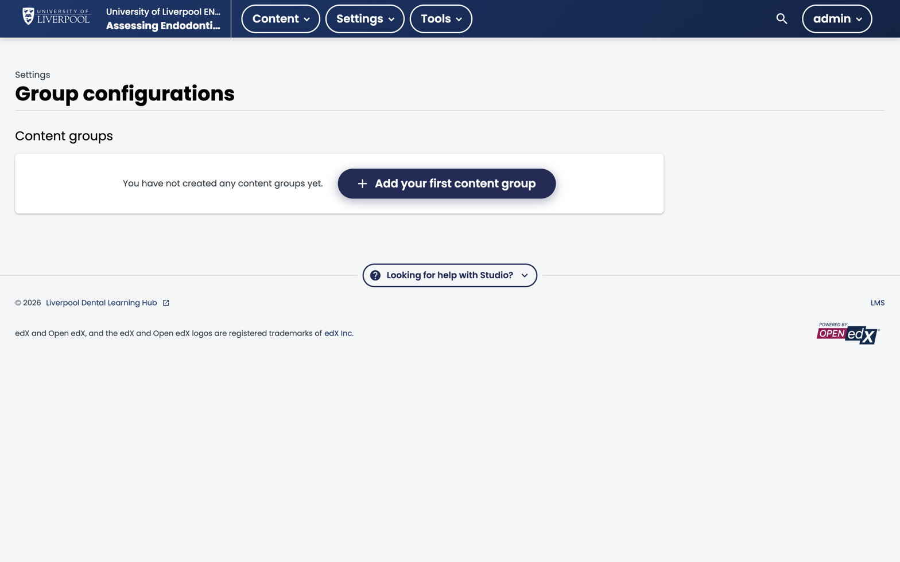

Sometimes you want to show different content to different learners in the same course — e.g. an undergraduate-vs-postgraduate variant of the same module. **Content Groups** are how Open edX does this.

*Studio → Settings → Group configurations. ENDO101 has no content groups defined — the default state. Click **Add your first content group** to create one.*

## When to use this

- Same core content, different stretch material for different audiences.
- Beta-testing a new module with a subset of learners.
- Region-specific guidance (rare in Liverpool Dental's UK-focused catalogue).

When *not* to use it: if the two audiences would never overlap, run two separate courses. Content groups add real complexity.

## How they work

1. **Define a Content Group Configuration** — Studio → *Settings → Group Configurations*. Add one configuration with two or more groups (e.g. *Undergraduate*, *Postgraduate*).
2. **Assign learners to groups** — LMS → *Instructor → Cohorts*. Map each cohort to a content group.
3. **Restrict component visibility** — In a unit, click *Access Settings* on a component and pick which group(s) can see it.

The learner only sees the components their cohort has access to.

## Limits

- Content groups apply at the component level, not section/subsection level.
- A learner is in exactly one group per configuration.
- Changing a learner's cohort changes what they see immediately — no rebuild.

---

*Adapted from [Open edX — Offer Different Content to Different Groups](https://docs.openedx.org/en/latest/educators/concepts/advanced/different_content_to_groups.html).*
