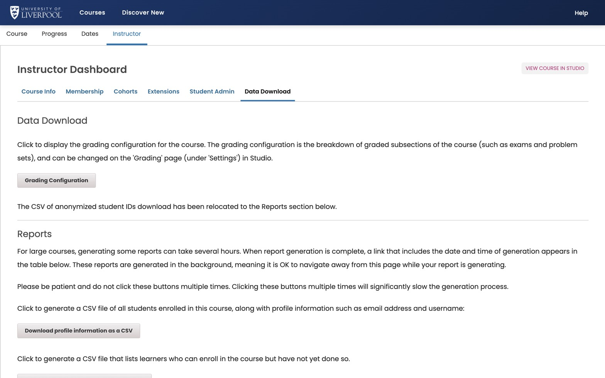

After a course has been running for a while, the most useful thing you can do is look at which distractors learners are picking. That tells you whether your assessment is testing what you think it is.

*Instructor → Data Download. Reports queue in the background; refresh the page after a minute to find the file under *Reports Available for Download*.*

## Where to find it

*Instructor → Data Download → "Problem Response Report"* — choose a specific problem (or all graded problems) and queue the report.

The output CSV gives you, per learner per problem:

- The text of the question.
- Each option and whether it was selected.
- The score awarded.

Pivot this in your tool of choice (a spreadsheet pivot table is plenty) to get a distractor-frequency table.

## What good looks like

- The correct answer is the most-picked option (obvious).
- The strongest distractor is the second most-picked — *a* misconception, not random noise.
- No option gets <5% — if nothing is picking it, it's not earning its place.

## What to do with the data

- A distractor that's never picked → swap for a better one.
- A distractor that beats the correct answer → either your item is wrong, or you've found a teaching priority. Both worth knowing.
- An item with very high success rate (>95%) → fine for confidence-building, but doesn't discriminate. Don't claim it's testing anything meaningful.
