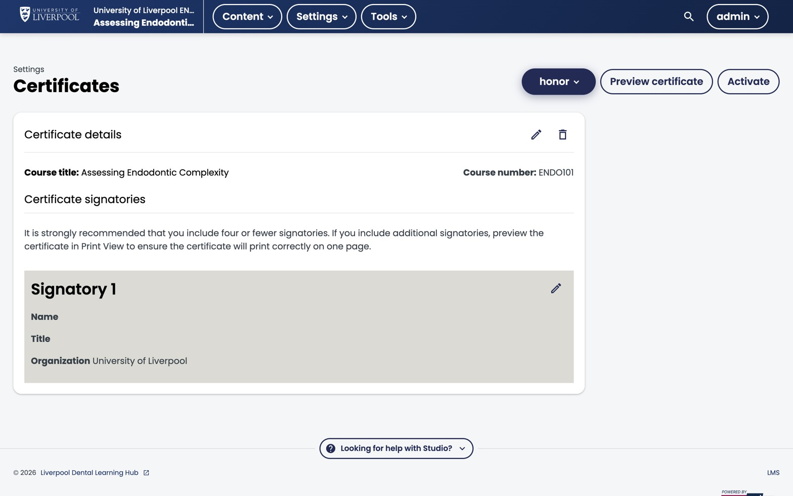

For CPD reporting, the certificate ledger is what matters — every issued certificate is a defensible record of completion.

*Studio → Settings → Certificates. Configure the certificate (signatories, organisation, mode) here, then click **Activate** to start issuing on pass.*

## Enabling certificates on a course

Certificates are off by default on new courses. To enable:

1. Studio → **Settings → Certificates**.
2. Configure a certificate (title, signatories, CPD hours).
3. Activate the certificate.
4. Verify the course's grading policy (pass threshold) is set correctly.

## How certificates are issued

In self-paced courses, certificates generate automatically when a learner crosses the pass threshold. No manual issuing required.

If the threshold or course content changes after enrolment, run *Instructor → Certificates → Regenerate Certificates* to re-evaluate.

## Auditing issued certificates

*Instructor → Data Download → "Certificate Status Report"* — CSV listing every learner who has earned a certificate, with date and grade.

For Liverpool Dental CPD recordkeeping, this is the canonical export. Keep dated copies.

## Re-issuing or revoking

- **Re-issue** — *Instructor → Certificates → Set Certificate Mode → Generate*.
- **Revoke** — *Instructor → Certificates → Invalidate Certificate* and provide a reason. The certificate URL stops working; the learner sees a "revoked" notice.

Revocation is rare but matters for compliance — e.g. if a clinical guideline change invalidates the course content and you need to require a retake.

---

*Adapted from [Open edX — View Certificate Data](https://docs.openedx.org/en/latest/educators/how-tos/data/view_certificate_data.html).*
