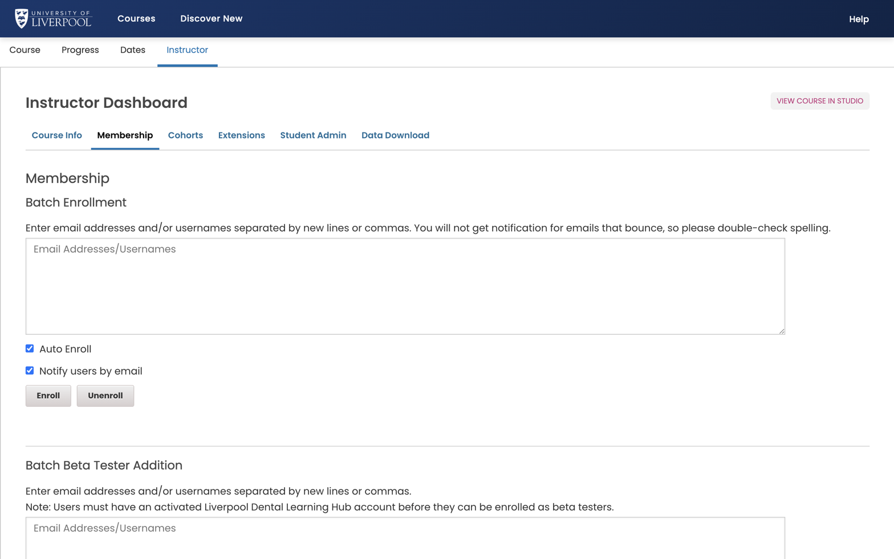

The instructor dashboard in the LMS is your source of truth for who's in your course. Two main views: a live summary and a CSV download.

*The **Membership** tab of the Instructor Dashboard for ENDO101. Paste a list of email addresses into Batch Enrollment, tick *Auto Enroll* and *Notify users by email*, then click **Enroll**.*

## Live summary

In the LMS, open the course → **Instructor → Membership**. You see:

- Current enrolment count.
- A paginated list of enrolled learners (email, username, enrolment date).
- A "batch enrol" form ([see enrolment guide](../../creating-a-course/enroll-learners/)).

## CSV download

For analysis — *Instructor → Data Download → "Enrolled Learner Profile Information"*. The CSV includes:

- Username, name, email.
- Enrolment date and mode (audit / honor / verified — all are *audit* in this deployment).
- Profile fields (year of qualification, GDC number if collected on registration).

Downloads are queued — refresh the page after a minute to find the file under *Reports Available for Download*.

## What you can't see here

- **Activity** — how far through the course they are. See [View learner data](../view-learner-data/).
- **Grades** — see [View learner grades](../view-learner-grades/).
- **Certificates issued** — see [View certificate data](../view-certificate-data/).

---

*Adapted from [Open edX — View Course Enrollments](https://docs.openedx.org/en/latest/educators/how-tos/data/view_course_enrollments.html).*
