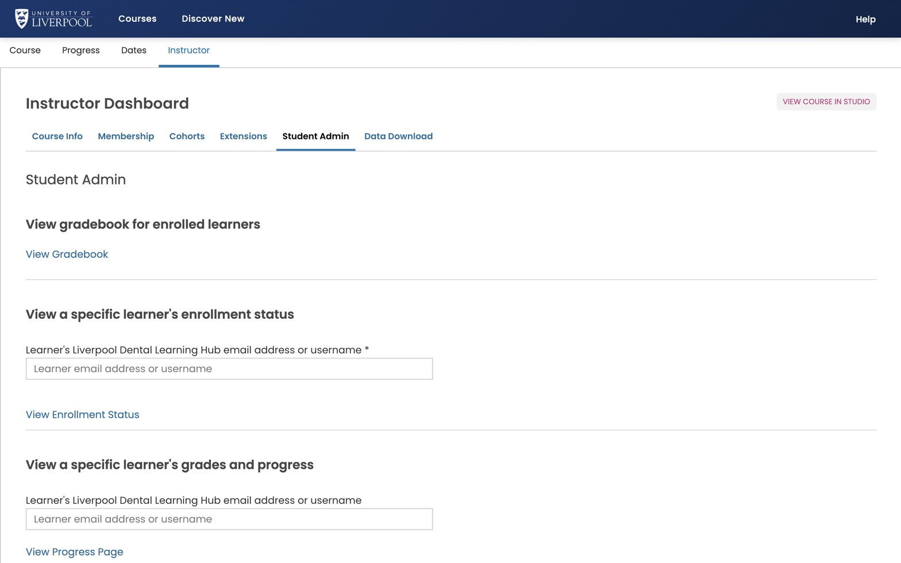

For per-learner activity (what they've watched, what they've answered, when they last logged in) you have two paths: the instructor dashboard reports, and direct queries via the admin/data team.

*Instructor → Student Admin. **View Gradebook** for the whole course, or look up a specific learner by email to see their enrolment status, grades, and progress.*

## In the LMS — Instructor → Student Admin

For a single learner:

1. Type their username or email.
2. *View Course Activity* shows last-active date.
3. *View Progress Page* opens their grade view.
4. *Student Gradebook* lets you adjust grades manually.

## CSV exports

*Instructor → Data Download → "Grading Configuration"* and *"Grade Report"* are the main per-learner CSVs:

- **Grade Report** — every learner × every graded subsection.
- **Problem Grade Report** — per-problem scores.

These are large for big courses — queue, then come back to the page.

## What's *not* in the LMS reports

- Time-on-page, video play heatmaps, click-by-click.
- Cross-course engagement.

Those live in deeper analytics (Cairn / Aspects). Not currently exposed on this deployment — raise a request via [dental.cpd@liverpool.ac.uk](mailto:dental.cpd@liverpool.ac.uk) if you need them.
