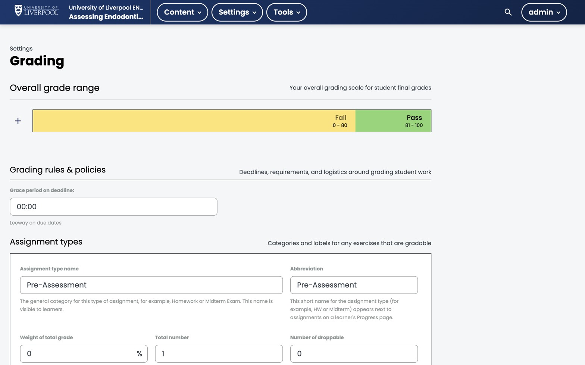

The gradebook is the canonical place to see and adjust grades. It's a per-course view in the LMS.

*Studio → Settings → Grading for ENDO101. The overall grade range sets the **Pass** band at 81–100; below that, learners fail. Assignment types (Pre-Assessment shown) weight the gradebook.*

## Opening the gradebook

LMS course view → **Instructor → Student Admin → View Gradebook**.

You see a row per learner with:

- Subsection scores.
- A computed course total.
- A pass/fail flag based on the grading policy.

## Adjusting an individual grade

1. Click into the learner.
2. *Adjust Grades for a Specific Learner*.
3. Pick the subsection or problem and override.

Overrides are logged. Be conservative — overrides bypass the normal attempt/grading rules, so document why in a course staff note.

## Downloading the full grade report

*Instructor → Data Download → Grade Report*. Returns a CSV with every learner × every graded subsection. Use this for end-of-cohort CPD reporting.

## Grading policy

The grading policy itself is set in Studio under **Settings → Grading**. Set:

- **Assignment types** — for CPD courses, usually a single "Assessment" type at 100% weight.
- **Pass threshold** — Liverpool Dental's default is **81%** (Pass band 81–100, Fail 0–80). Check the course's CPD claim before changing.
- **Grade range** — pass/fail unless you want graded letters.

---

*Adapted from [Open edX — View Learner Grades](https://docs.openedx.org/en/latest/educators/how-tos/data/view_learner_grades.html).*
