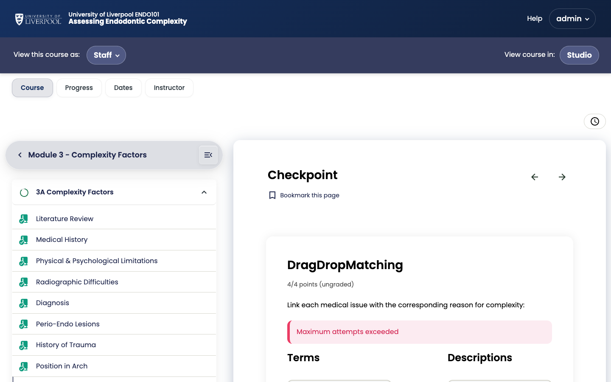

:::note[Prefer coursekit for new content]
Native Open edX problem editing is documented here for reference and for working with legacy items. **For new content, use [coursekit](../../content/authoring-with-coursekit/)** — added via *Add Component → Advanced → coursekit* in Studio.
:::

In Open edX, *Problem* is the umbrella for any question type. They share the same framework: a prompt, one or more inputs, automatic grading, attempt limits, and feedback.

*The `drag-drop-matching-xblock` (one of the 11 custom Liverpool Dental XBlocks) as the learner sees it in an ENDO101 checkpoint.*

## Shared settings on every problem

| Setting | What it controls |
|---|---|
| Display name | Shown to learners above the question |
| Maximum attempts | Blank = unlimited (default for CPD) |
| Weight | Score weighting within the subsection |
| Randomization | Whether to re-shuffle options between attempts |
| Show answer | "Always" / "Past due" / "Never" — default to *After last attempt* for CPD |

## Built-in question types

- [Single select (multiple choice)](../single-select-problem/)
- [Multi-select (checkboxes)](../multi-select-problem/)
- [Dropdown](../dropdown-problem/)
- [Text input](../text-input-problem/)
- [Numerical input](https://docs.openedx.org/en/latest/educators/references/exercise_tools/numerical_input_problem.html)
- [Open response assessment](../open-response-assessments/)

## Liverpool Dental custom XBlocks

The deployment ships 11 custom interactive XBlocks. Add them via **Add Component → Advanced**:

| XBlock | Use for |
|---|---|
| `accordion` | Collapsible sections of reference content |
| `tabs` | Side-by-side comparisons (e.g. clinical vs radiographic findings) |
| `flashcards` | Spaced-repetition style revision |
| `image-commentary-xblock` | Annotated stills with author commentary |
| `image-hotspot-xblock` | Click-to-identify on an anatomical image |
| `image-annotation-xblock` | Free-form learner annotation on an image |
| `drag-drop-matching-xblock` | Pair items (e.g. instrument → use) |
| `sort-into-bins-xblock` | Categorise items (e.g. carious vs sound surfaces) |
| `content-blocks` | Layout primitives — cards, columns |
| `audio-player-xblock` | Custom audio player with timing controls |
| `timeline-presentation-xblock` | Sequential case-progression display |

These are pinned via `XBLOCKS_SHA` in [`liverpool-dental-deploy/versions.lock`](https://github.com/brainjamworks/liverpool-dental-deploy/blob/master/versions.lock). When the deploy team bumps the SHA, all 11 update together.

## Writing problems — the Markdown shortcut

The problem editor supports a Markdown-like syntax that's faster than the visual editor once you know it. The top of every problem template shows an example — start there.

---

*Adapted from [Open edX — The Open edX Problem Component](https://docs.openedx.org/en/latest/educators/concepts/exercise_tools/openedx_problem.html).*
