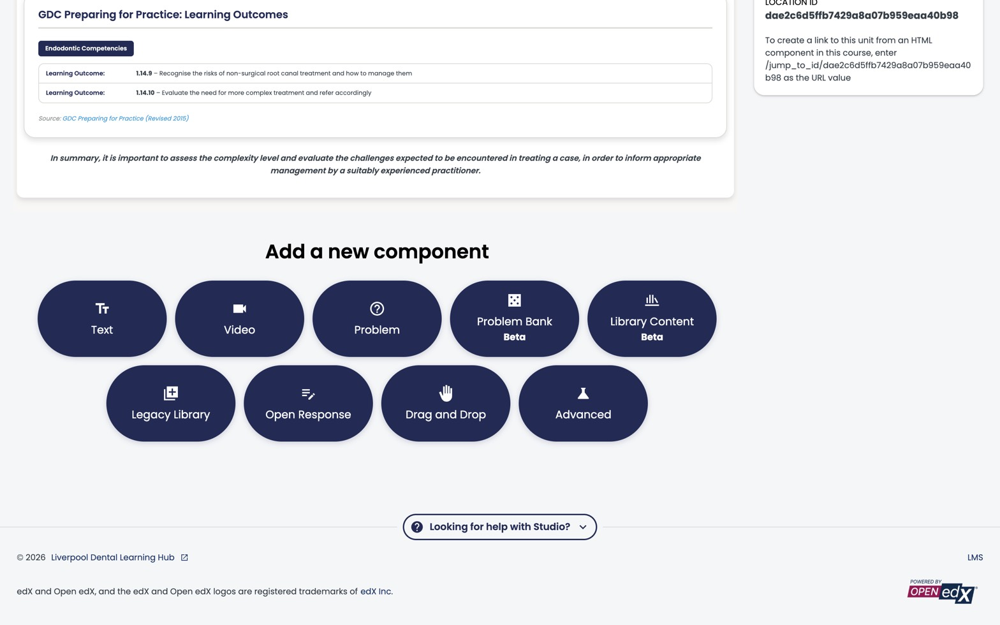
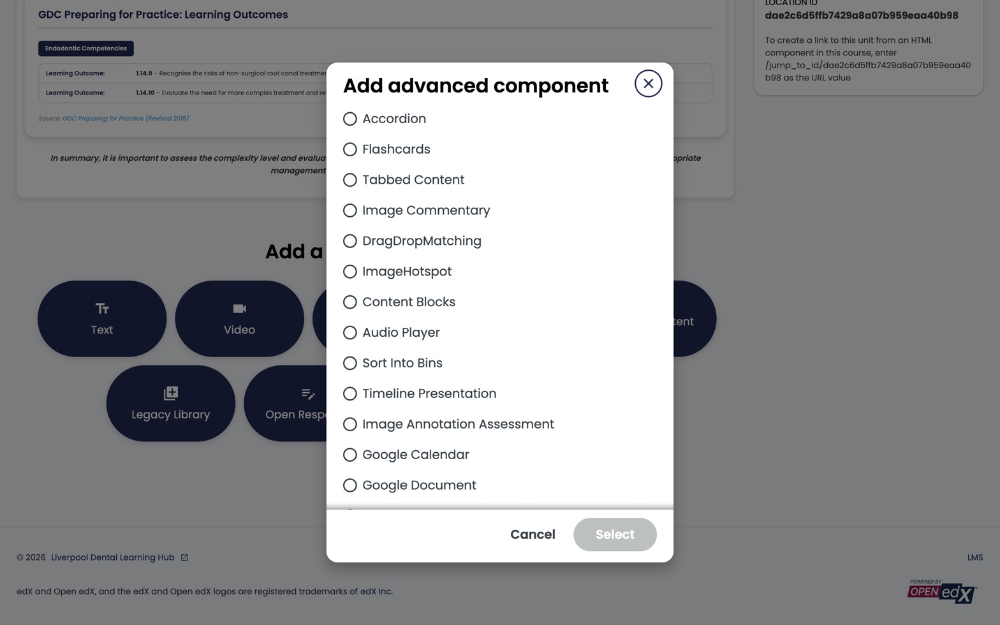

For new course content on the Liverpool Dental Learning Hub, **coursekit** is the preferred authoring surface. It's an Advanced XBlock added through Studio's normal *Add Component* flow — the rest of Studio (outline, publishing, scheduling, certificates) is unchanged.

This page covers how to launch coursekit from Studio. For the content-authoring workflow itself — writing questions, building image-hotspot interactions, sequencing tasks — see the [coursekit docs](https://coursekit.dev/docs/) *(link TBD — placeholder until the docs site lands)*.

:::caution[Not yet installed]
The coursekit XBlock isn't installed on `studio.learning.endo360.uk` yet — this page documents the launch flow ahead of rollout. Once the deploy team enables it, coursekit will appear in the *Advanced* component picker below alongside the existing Liverpool XBlocks.
:::

*Scroll to the bottom of any unit in Studio to find the *Add a new component* strip. **Advanced** is the gateway to the coursekit XBlock.*

*The Advanced modal. The 11 Liverpool XBlocks already live here; coursekit will join them in the same list once installed.*

## Why coursekit, not the native problem editor

Open edX's built-in problem editor pre-dates modern authoring tools and shows it. coursekit is a block-stack editor (MCQ, multi-select, sequencing, image-hotspot, drag-drop, categorise, matching) built for educators who write course content full-time. It runs entirely inside Studio via the XBlock adapter; nothing extra to deploy, nothing to maintain separately.

If you've used the native Open edX problem editor before and found it slow, that's the experience coursekit replaces.

## Adding a coursekit block to a unit

1. **Open the unit** in Studio (`studio.learning.endo360.uk` → your course → outline → unit).
2. **Add Component → Advanced.**
3. From the Advanced dropdown, choose **coursekit**.
4. The block appears in the unit. Click **Edit** to open the coursekit editor.
5. Author your content inside coursekit — the editor is the full coursekit experience, embedded in Studio.
6. **Save** in coursekit, then **Publish** the unit in Studio as you would any other component.

## When you might still reach for the native editor

Two cases:

- **Quick prose-only blocks** — for a one-line text snippet between two coursekit blocks, the native HTML/Text component is fine.
- **Reference / legacy items** — existing problems written in the native editor before coursekit will keep working. You don't need to migrate them on a fixed schedule, but the bar for new content is coursekit.

The native problem types are still documented in this guide for those reference cases (see [The problem component](../../components/problem-component/) and below). Most authors won't need to reach for them.

## Files & uploads

Images, PDFs, and other static assets you reference from coursekit (or anywhere else in the course) still upload through Studio's **Content → Files & Uploads**. Liverpool Dental's deployment routes these to S3 automatically — see [Manage video components](../manage-video-components/) for the same note about video.

## Publishing and visibility

coursekit blocks publish, schedule, and gate exactly like any other Studio component. The full Studio publish/visibility model is covered in [Control content visibility and access](../content-visibility/).

---

*coursekit is built by BrainJam. The XBlock adapter source and docs will live at [coursekit.dev](https://coursekit.dev/) (placeholder).*
