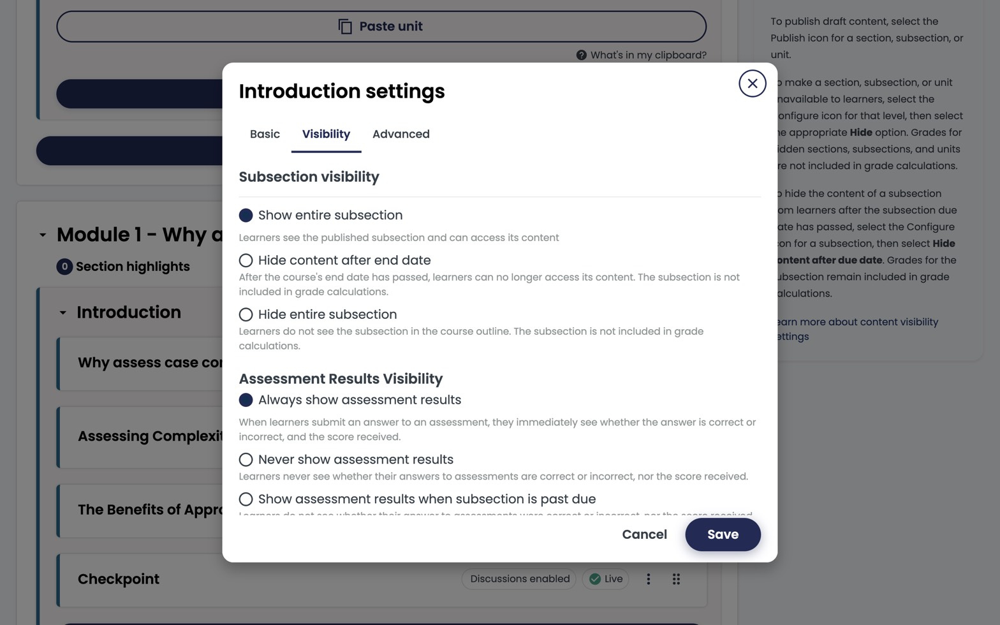

Every section, subsection, unit, and component has independent visibility settings. Misconfigure these and learners either see unfinished content or can't see content you've finished — get this mental model right early.

*Subsection settings → Visibility. Two control groups: **Subsection visibility** (show all / hide after due date) and **Assessment results visibility** (always / never / past-due).*

## The three layers of visibility

### 1. Publish state

- **Draft** — only visible in Studio preview.
- **Published, not yet released** — locked behind a release date.
- **Published and released** — live to learners.

### 2. Release date (subsection-level)

Set under the subsection's settings. Content with a future release date appears greyed out in the LMS until the date passes.

For self-paced courses you usually leave release dates blank — everything available from enrolment.

### 3. Staff-only flag (unit-level)

Mark a unit as **Staff Only** to keep it visible to course staff but hidden from learners. Useful for:

- Internal author notes.
- Content under clinical review.
- Holding pen for next module.

## Due dates

Set due dates per subsection for graded assessments. In self-paced courses, due dates are relative to the learner's enrolment date if *Self-paced* is enabled — otherwise they're absolute.

## Cohort and group-scoped content

Use **Content Groups** to show different content to different cohorts. See [Offer different content to different groups](../../advanced/different-content-different-groups/).

## A common mistake

Hitting **Publish** on a unit doesn't change anything for learners if the parent subsection is still in draft. Always publish from the highest level you're ready to release — Studio will cascade.
