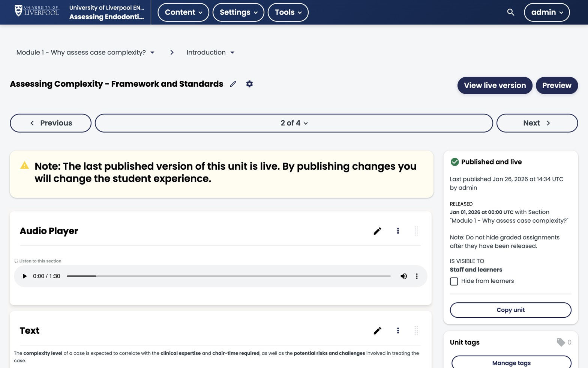

:::note[Day-to-day authoring uses coursekit]
The Studio *Add Component* menu is the entry point. For new interactive content (problems, image-hotspot, drag-drop, sequencing), choose *Advanced → coursekit* — see [Authoring with coursekit](../authoring-with-coursekit/). The component types below remain documented for reference and Studio chrome (publishing, visibility, file uploads).
:::

A **component** is anything that lives inside a *unit*. You drop components into a unit in the order learners will see them, top-to-bottom. Get fluent with this — it's where 80% of authoring time goes.

*A unit open in Studio. Each card is a component — here, an `audio-player-xblock` followed by a Text component. The right rail shows publish state and visibility; the left rail shows where you are in the outline.*

## Component types

| Type | What it is | Common use |
|---|---|---|
| Text | Rich-text block (TinyMCE editor) | Intros, explanations, references |
| Video | Hosted or YouTube video | Lectures, demos |
| Problem | Question — many sub-types | MCQ, dropdown, open response, etc. |
| Discussion | Embedded forum thread | Reflection prompts |
| Advanced (XBlocks) | Custom interactives | Liverpool Dental case-based blocks |

## Adding a component

1. Open the unit.
2. Click **Add New Component**.
3. Pick the type. For *Problem* and *Advanced* you'll see a second menu listing variants.
4. Edit, then click **Save**.

## Drafts vs published

Every component has a state:

- **Draft (unpublished changes)** — visible only in Studio preview.
- **Published** — visible in the LMS once the parent unit is published.

The unit publish button publishes *all* components inside it. You can't publish a single component without publishing its parent unit.

## Reusing content

Studio has a **Library** feature for cross-course reuse, but for most Liverpool Dental courses it's overkill. If you find yourself copy-pasting the same component into three courses, ask [dental.cpd@liverpool.ac.uk](mailto:dental.cpd@liverpool.ac.uk) about wiring up a library.

## Liverpool Dental custom XBlocks

The deployment ships 11 custom interactive XBlocks for case-based learning. See [The problem component](../../components/problem-component/) for the full list.

---

*Adapted from [Open edX — Create and Manage Components](https://docs.openedx.org/en/latest/educators/concepts/courseware/create_manage_components.html).*
