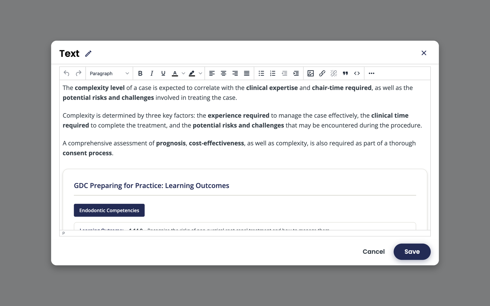

Text components are the workhorse — explanations, transitions, references, callouts. Studio uses the **TinyMCE** rich-text editor (patched to use Poppins to match the Liverpool theme).

*The TinyMCE editor open on a Text component in Studio. Toolbar covers paragraph style, formatting, alignment, lists, images, links, and the HTML-source button (`<>`).*

## What you can do in the editor

- Headings (H2–H4 — H1 is the unit title, don't add another).
- Bold, italic, lists, blockquote, links.
- Tables — works fine for small data; avoid for layout.
- Images — uploaded to *Files & Uploads* (S3-backed in this deployment).
- HTML source view — when you need an embed or precise markup.

## Uploading images

1. Click the *Insert Image* button in the editor.
2. Upload from your computer, or pick an existing file from *Files & Uploads*.
3. **Always set alt text** — this is an accessibility requirement, not optional. See the [accessibility checklist](../../accessibility/checklist/).

Images are stored in the course's S3 bucket; URLs include the asset key so they don't break if you re-import the course.

## Embedding video without using a Video component

You can paste an `<iframe>` into the HTML source view, but prefer a real [video component](../manage-video-components/) when possible — you get the player controls, transcripts, and analytics for free.

## Style notes

- The Liverpool Dental theme styles headings, lists, blockquotes, and tables consistently. Don't override colours or fonts inline — let the theme handle it.
- Keep blocks short. A wall of text is the most common learner complaint.

## Accessibility

- Alt text on every image.
- Real headings, not bold-as-heading.
- Descriptive link text — never "click here".
