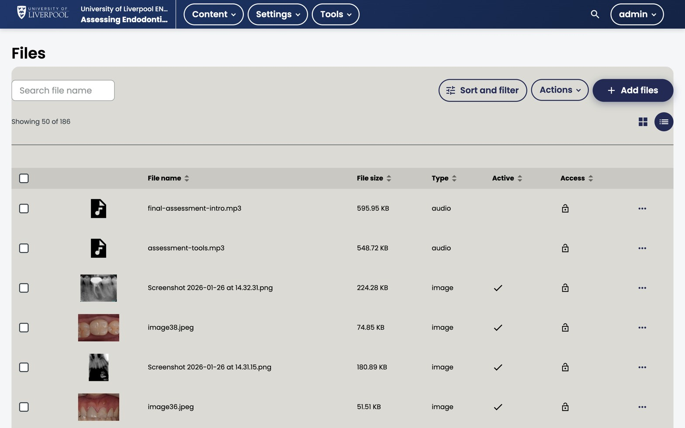

Video is the heaviest asset you'll ship. Get the workflow right once and you save hours per course.

*Studio → Content → Files. ENDO101 has 186 assets including audio narration (`final-assessment-intro.mp3`) and clinical images. All routed to Liverpool Dental's S3 bucket via the `tutor-contrib-s3` plugin.*

## Hosting options

| Option | When to use | Notes |
|---|---|---|
| **YouTube (unlisted)** | Default for most CPD content | Free CDN, captions easy, but logs out of your domain |
| **Uploaded video** | Sensitive content, no external embed allowed | Stored on S3 (Liverpool Dental's media bucket) — see [hosting note](#hosting-on-s3) |
| **Vimeo / Wistia** | Bespoke productions | Use the HTML5 video URL field |

## Adding a video

1. *Add Component → Video*.
2. Paste the YouTube URL **or** upload an `.mp4`.
3. Set the display name.
4. Save.

## Transcripts (always add one)

- For YouTube videos: download captions or paste a manually corrected transcript.
- For uploaded videos: upload a `.srt` or `.vtt` file in the Video editor.

This is a GDC/WCAG accessibility requirement. See [Manage video transcripts](../../accessibility/video-transcripts/).

## Hosting on S3

Uploaded videos go to the Liverpool Dental S3 bucket via the `tutor-liverpool-dental` plugin's storage routing. You don't need to do anything — uploads through Studio Just Work — but if you're considering uploading 50 GB of source video, mention it to [dental.cpd@liverpool.ac.uk](mailto:dental.cpd@liverpool.ac.uk) first.

## Video best practice for CPD

- Keep individual clips under 8 minutes — split longer recordings.
- Speaker on camera in a corner, slides centred, is the most-watched format.
- Show one key reference at the end so learners can cite the source.

---

*Adapted from [Open edX — Manage Video Components](https://docs.openedx.org/en/latest/educators/how-tos/manage_video_components.html).*
