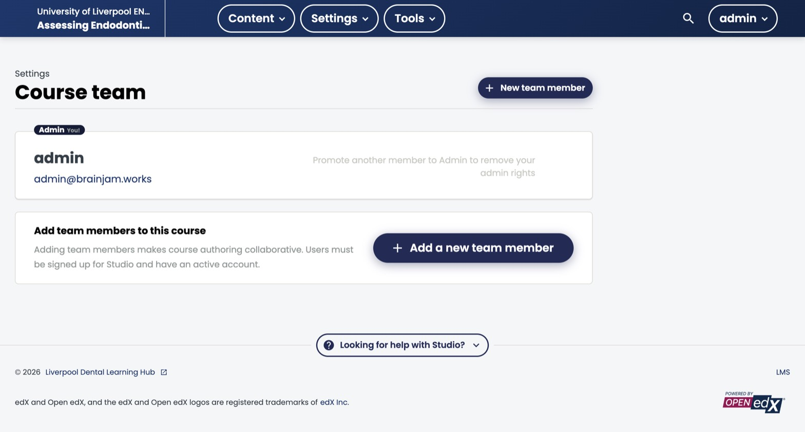
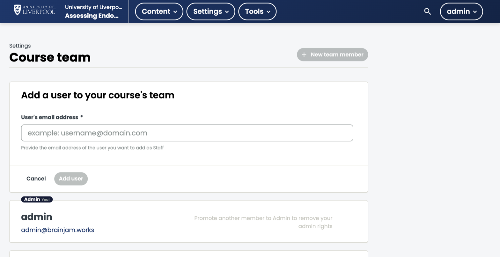

A course starts with one person — whoever created it — as its sole Admin. To collaborate with other clinicians, instructional designers, or reviewers, add them to the **course team**. This page covers how, and the difference between the two roles.

## Before you start

Anyone you add must already have an account on `learning.endo360.uk` **and have activated it** (clicked the confirmation link in their sign-up email). Studio spells this out on the page itself:

> Users must be signed up for Studio and have an active account.

If they haven't registered yet, send them to the login page first — you can't invite by email address alone; the account has to exist so Studio can attach the role to it.

You'll also need the **email address they registered with** (not their username, and not a shared inbox).

## Open the Course Team page

In Studio (`studio.learning.endo360.uk`), open the course and choose **Settings → Course Team** from the top menu. You'll see everyone currently on the team, with their role next to their name.

*The Course Team page. The person who created the course starts as the sole Admin. The empty state reminds you that new members need an active account first.*

## The two roles

**Staff** — can view and edit all course content in Studio, view learner data and grades in the LMS, send bulk emails, activate certificates, and enrol or unenrol learners. Cannot add, remove, or change the role of other team members.

**Admin** — everything a Staff member can do, plus adding and removing team members, changing member roles, and modifying grades across the whole cohort (not just individual learners).

Give most colleagues **Staff**. Reserve **Admin** for the one or two people who own the course long-term and need to manage access. Studio prevents you from demoting yourself if you're the only Admin — the card shows *"Promote another member to Admin to remove your admin rights"* — so there's always at least one Admin on the course.

## Add someone to the team

1. On the Course Team page, click **New team member** (top right) or **Add a new team member** in the empty-state card.
2. Enter the person's registered email address in the form that appears.
3. Click **Add user**.

*The add-user form. New members are added as **Staff** by default — the helper text under the field confirms this.*

They'll see the course in their Studio dashboard the next time they log in. If Studio can't find an account for that email, the add will fail — that's the "must have an active account" rule kicking in.

## Promote a Staff member to Admin

Find them in the team list and click **Add Admin Access** on their card. The change takes effect immediately; they'll see the "New team member" button and role controls the next time they open the page.

## Remove someone or demote them

To take Admin rights back but keep them on the team, click **Remove Admin Access** on their card.

To remove them from the course entirely, click the **Delete** (bin) icon on their card. Their access is revoked immediately.

You cannot delete or demote the sole remaining Admin — promote someone else first, then step down.

## Who can do what

|                                          | Staff | Admin |
|------------------------------------------|:-----:|:-----:|
| Edit course content in Studio             | ✓     | ✓     |
| View and modify individual learner grades | ✓     | ✓     |
| Modify grades across the whole cohort     |       | ✓     |
| Send bulk emails                          | ✓     | ✓     |
| Enrol or unenrol learners                 | ✓     | ✓     |
| Activate certificates                     | ✓     | ✓     |
| Add or remove team members                |       | ✓     |
| Change another member's role              |       | ✓     |

## What course team access does *not* include

Course team roles are **scoped to a single course**. Adding someone to the team for *Assessing Endodontic Complexity* does not give them access to *Management of Dental Trauma*, and it does not let them create brand-new courses. Course-creation rights are granted separately by the platform team — email `dental.cpd@liverpool.ac.uk` if a colleague needs to author a new course from scratch.

Some more granular LMS roles (Beta Tester, Discussion Admin, Discussion Moderator, Community TA) live on the **LMS Instructor Dashboard → Membership** tab rather than on this Studio page. Use those when you want someone to help moderate discussions or preview unreleased content without giving them full Staff access.
