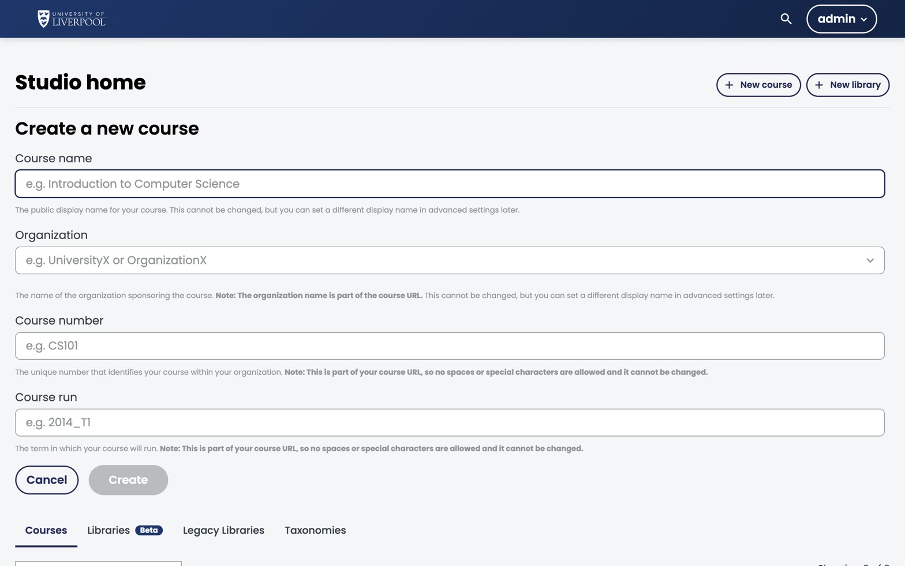

This is the literal first step: an empty course shell with title, number, run, and dates. Five minutes of work, but the values you pick here are hard to change later — so read this page first.

*Studio's *Create a new course* form. The four fields below are the only required values, and **none of them can be changed after you click *Create*.***

## Before you start

You need an author account on `studio.learning.endo360.uk`. If you don't have one, email [support@learning.endo360.co.uk](mailto:support@learning.endo360.co.uk).

## Steps

1. **Sign in** to `studio.learning.endo360.uk`.
2. From the Studio home page, click **New Course**.
3. Fill in the four required fields:

   | Field | What to enter | Example |
   |---|---|---|
   | Course name | Public-facing title | *Assessing Endodontic Complexity* |
   | Organization | Always `University_of_Liverpool` | `University_of_Liverpool` |
   | Course number | Department code + topic | `ENDO101` |
   | Course run | Year, or year + term | `2026` or `2026_T1` |

4. Click **Create**. You land on the empty *Outline*.

## Naming conventions

- **Course Number** — uppercase, no spaces. Pattern: `<dept><level>` e.g. `ENDO101`, `PERIO202`, `RESTO301`.
- **Course Run** — `YYYY` for evergreen, `YYYY_S<n>` if you'll have multiple cohorts per year.
- **Course Name** — title case, descriptive enough to read in a list of 50 courses.

The course's permanent URL slug is built from these three values:
`course-v1:University_of_Liverpool+ENDO101+2026`. You can't rename them after creation, so get them right now.

## What to do next

1. Set the **schedule** (Settings → Schedule & Details).
2. Add a **course image** and **course overview** text — these appear on the course-about page.
3. Add **CPD hours** and **GDC outcomes** to the overview text.
4. Start building the [outline](../plan-a-new-course/).
