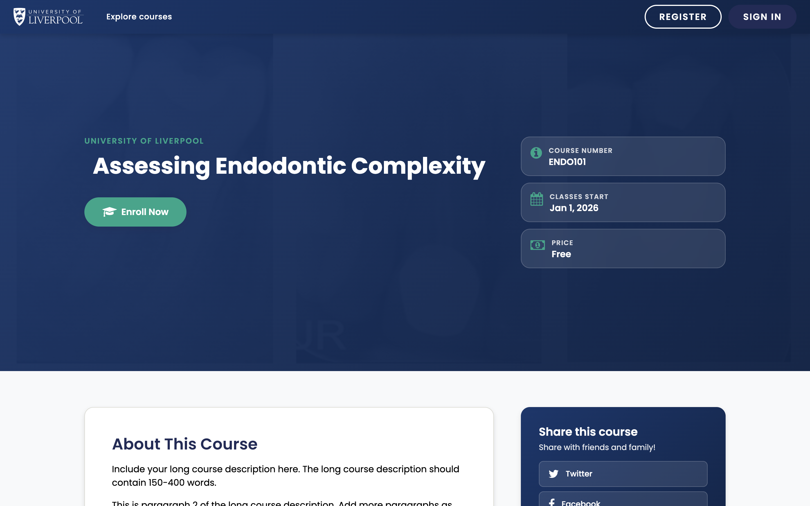

Once a course is published, learners get into it one of three ways. Pick the right one before you announce the course.

*The course-about page learners hit when they click a course tile in the catalogue. The **Enrol Now** button kicks off self-enrolment.*

## Three enrolment paths

### 1. Self-enrolment (default)

Anyone with an account on `learning.endo360.uk` can browse the course catalogue and click *Enrol*. This is the default and what most Liverpool Dental CPD courses use.

Toggle under **Settings → Schedule & Details → Course Visibility** in the catalogue.

### 2. Invitation-only

Set the course to *Invitation Only* if you want to gate enrolment (private cohorts, beta groups). Learners then need to be enrolled by an admin via the LMS Instructor dashboard.

### 3. Bulk enrolment from a CSV

Use this for cohort programmes or whole-practice sign-ups.

1. In the **LMS**, open the course as an instructor.
2. *Instructor → Membership → Batch Enrolment*.
3. Paste email addresses (one per line) and click **Enrol**.
4. The Learning Hub sends each new email address an invitation to create an account; existing users are enrolled immediately.

## Capacity, payments, and codes

The Liverpool Dental deployment does **not** currently have e-commerce wired up, so course-level pricing is a label only — there are no checkout flows. If you need paid enrolment, raise it with [support@learning.endo360.co.uk](mailto:support@learning.endo360.co.uk) before you publish.

## Checking who is enrolled

- **LMS → Instructor → Data Download → Enrolled Learner Profile Information** (CSV).
- Or use the in-LMS *Membership* page for a paginated view.

See [View course enrolments](../../analytics/view-course-enrollments/).
