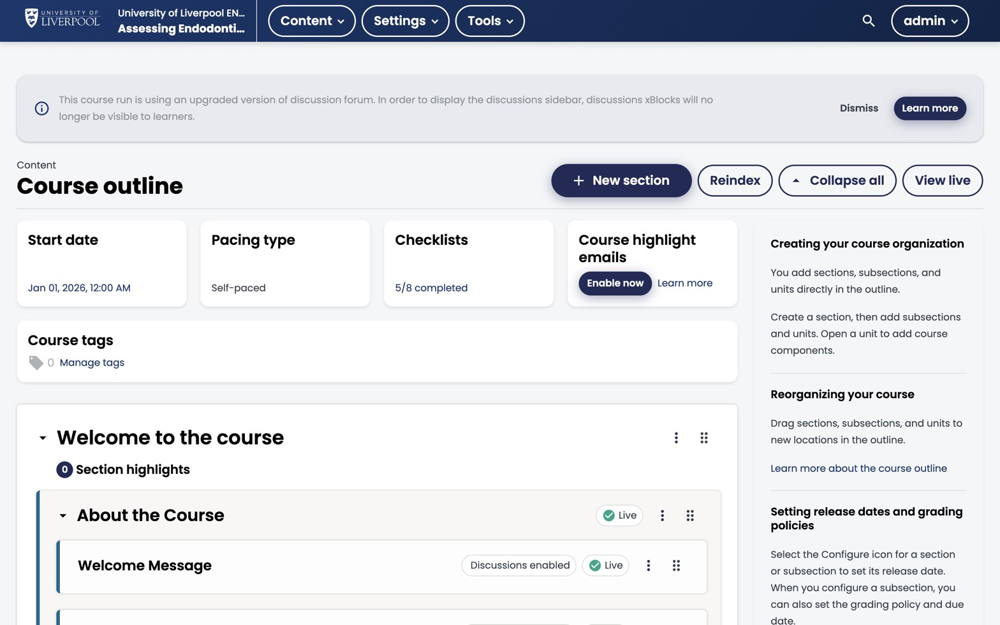

Before opening Studio, it's worth spending a few minutes on instructional design — the shape of the course matters more than the polish. For Liverpool Dental CPD this also intersects with **GDC development outcomes** and how you plan to justify CPD hours.

*ENDO101's outline in Studio. Sections expand into subsections, which expand into units. The unit *Welcome Message* is published (live) with discussions enabled.*

## The Open edX hierarchy

Every course in Studio follows the same nested structure:

| Level | Studio name | What it usually represents | Example |
|---|---|---|---|
| Top | Section | A module or week | "Module 1 — Endodontic diagnosis" |
| Middle | Subsection | A topic or session | "Pulpal vs periapical disease" |
| Bottom | Unit | A single page of content | "Case overview" |
| Inside a unit | Component | Text, video, problem, or XBlock | A 4-min video + 3 MCQs |

Subsections are the unit of grading — when you set a graded assessment, you're grading at the subsection level, not per problem.

## Aligning to CPD hours and GDC outcomes

For each course, decide up front:

1. **Total CPD hours** — recorded under *Settings → Schedule & Details*. Be honest about realistic study time, not the absolute minimum.
2. **GDC development outcomes** addressed (A, B, C, D) — list these in the course overview text so learners can match them to their PDP.
3. **Assessment that justifies the hours** — at minimum one end-of-module assessment per CPD hour claimed is a defensible baseline.

## Bloom-aligned activities

Use the right component type for the cognitive level:

- **Remember / understand** → text + single-select / dropdown / multi-select MCQs.
- **Apply / analyse** → image-hotspot, drag-drop-matching, sort-into-bins XBlocks (case-based reasoning).
- **Evaluate / create** → open-response assessments with a rubric, or image-annotation tasks.

The Liverpool Dental deployment ships 11 custom XBlocks for case-based learning — see [The problem component](../../components/problem-component/) for the list.

## A 5-minute planning checklist

- [ ] One sentence: who is this course for? (e.g. *"GDPs three years post-qualification revisiting endodontic case selection"*)
- [ ] 3–5 learning outcomes, each starting with an active verb.
- [ ] Total CPD hours and GDC outcomes decided.
- [ ] Section outline sketched on paper before you open Studio.
- [ ] One assessment item planned per learning outcome.

---

*Adapted from [Open edX — Instructional Design Concepts](https://docs.openedx.org/en/latest/educators/concepts/instructional_design/instructional_design.html).*
