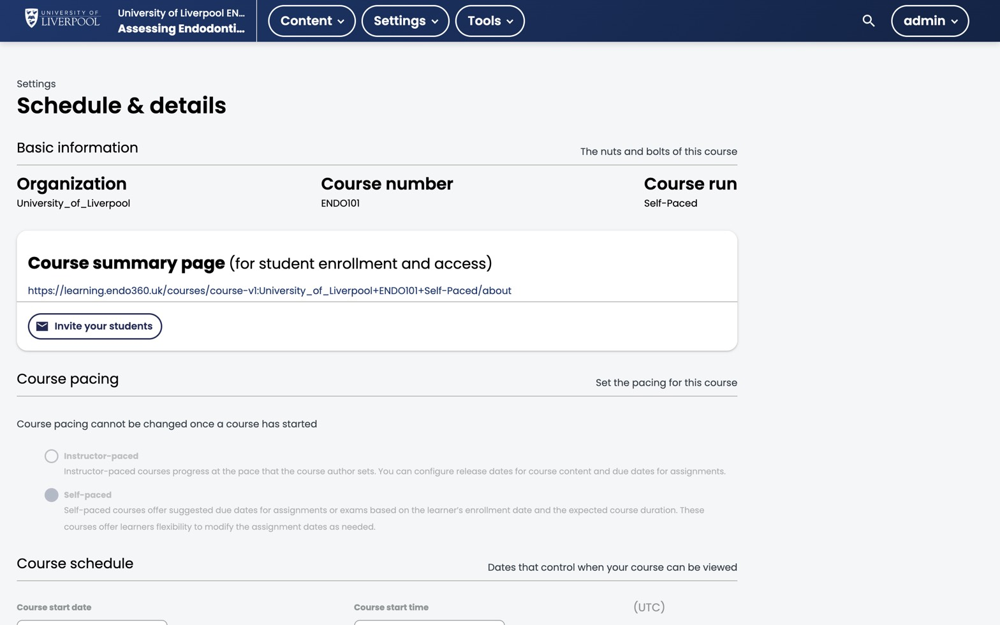

Most Liverpool Dental courses are **self-paced** — learners enrol whenever and finish whenever — so the planning decisions here differ from a cohort-paced university module. This page covers the choices that matter.



*Settings → Schedule & Details for ENDO101. The pacing radio sits in the middle — **once the course has started, the choice locks**, so set it correctly on day one.*

## Self-paced vs instructor-paced

| | Self-paced | Instructor-paced |
|---|---|---|
| Start date | Course-open date for the learner | Hard start; content reveals on schedule |
| Best for | Single-author CPD modules | Multi-week cohort programmes |
| Discussion volume | Low — async | Higher — needs moderation |
| Default for Liverpool Dental | ✓ | rarely used |

Set this under **Settings → Schedule & Details → Course pacing**. Pick *Self-paced* unless you're explicitly running a cohort. Once the course has started, the choice can't be changed — Studio greys the radio buttons out.

## Schedule fields that matter

- **Course Start Date** — the first date learners can see content. For self-paced courses set this to "now" or a sensible launch date.
- **Course End Date** — leave blank for evergreen CPD, or set it if the content has a clinical-guidelines expiry.
- **Enrolment Start / End** — controls *enrolment*, not *access*. Leave start blank to allow enrolment from day one.

## A workable outline pattern

For a 1–3 CPD hour module:

```
Section 1 — Introduction
  Subsection — Welcome & learning outcomes (1 unit)
  Subsection — Pre-assessment (1 unit, ungraded)

Section 2 — Core content
  Subsection — Topic A  (2–4 units)
  Subsection — Topic B  (2–4 units)
  Subsection — Topic C  (2–4 units)

Section 3 — Apply
  Subsection — Case-based exercises (XBlocks)

Section 4 — Assess
  Subsection — End-of-module assessment (graded)
  Subsection — Reflection prompt (ungraded)
```

The pre/post pattern lets learners self-rate against the end-of-module score, which is a strong CPD reflection signal.

## What to do next

- [Create and manage components](../../content/create-and-manage-components/)
- [Control content visibility and access](../../content/content-visibility/)
