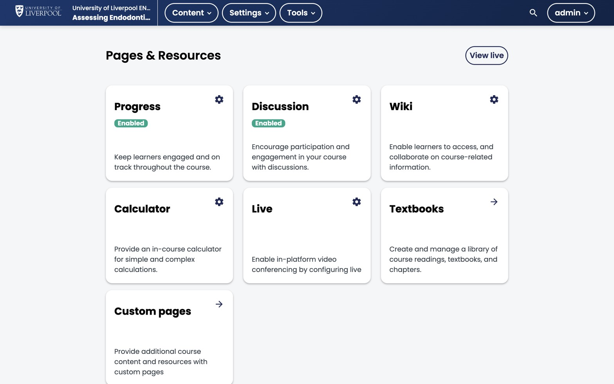

The Learning Hub has a built-in threaded discussion system. For self-paced CPD courses, async discussion is usually low-volume — so the question isn't *whether to enable it* but *what role you want it to play*.

*Studio → Content → **Pages & Resources**. Discussion is enabled here; the gear icon opens topic configuration. Wiki, Calculator, Live, Textbooks, and Custom pages live on the same screen.*

## Two patterns that work

### A. Course-wide Q&A (recommended default)

A single "Questions for the team" topic, lightly moderated. Learners post questions, an instructor checks in weekly. Low maintenance, useful safety net.

### B. Topic-anchored discussions

Discussion components dropped into specific units (e.g. after a case study). Higher engagement, but only if you have someone moderating — silent discussion threads are worse than no discussion.

## Enabling discussions

Discussions are on by default. The pieces you may want to configure:

1. **Discussion topics** — defined in **Settings → Advanced Settings → Discussion Topic Mapping**.
2. **Inline discussion components** — added to a unit via *Add Component → Discussion*.
3. **Cohort visibility** — if you use cohorts, you can scope discussions per cohort.

## Moderation roles

In the LMS Instructor dashboard:

- **Discussion Admin** — full moderation, post in any role.
- **Discussion Moderator** — moderate posts and replies.
- **Discussion Community TA** — flag-and-respond, no delete.

Assign at least one Moderator per active course.

## Notifications

Learners get email digests by default. Course authors should subscribe to topics they own so you don't miss a clinical correction.
