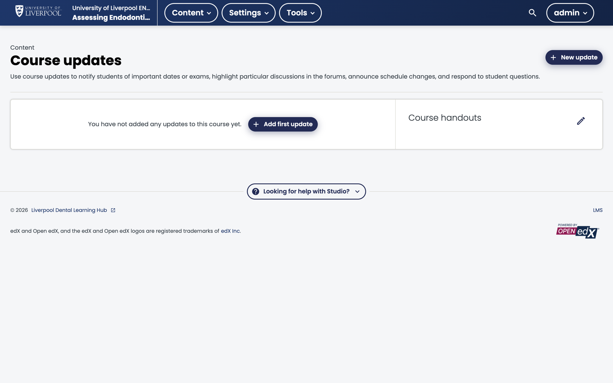

Course updates appear on the course home page, above the outline. They're low-friction (no email triggered) and the right place for routine module-by-module news.

*Studio → Content → Course updates. Updates added here appear at the top of the course home in the LMS. Course handouts (right) are the permanent sidebar of files and links.*

## How updates work

- Each update has a date and rich-text body.
- The most recent update shows expanded; older ones collapse.
- Updates are course-wide — not unit-scoped.

## Good uses

- "Module 3 is now live."
- "Updated clinical reference link on the diagnosis page."
- "Live Q&A this Thursday at 7 pm — Zoom link in your enrolment email."

## Adding an update

1. In Studio, open the course.
2. **Content → Updates**.
3. Click *New Update*, write the body, save.
4. Updates are published immediately — no rebuild needed.

## Handouts

The same page hosts a **Handouts** section — a permanent sidebar of links and files. Use this for:

- Reading lists.
- PDFs of slides or case packs.
- External resources that aren't a graded part of the course.

## Updates vs bulk email vs discussions

| Need | Use |
|---|---|
| One-off announcement, all learners, no email | Course update |
| One-off announcement, all learners, with email | [Bulk email](../bulk-emails/) |
| Ongoing conversation | [Discussions](../course-discussions/) |
