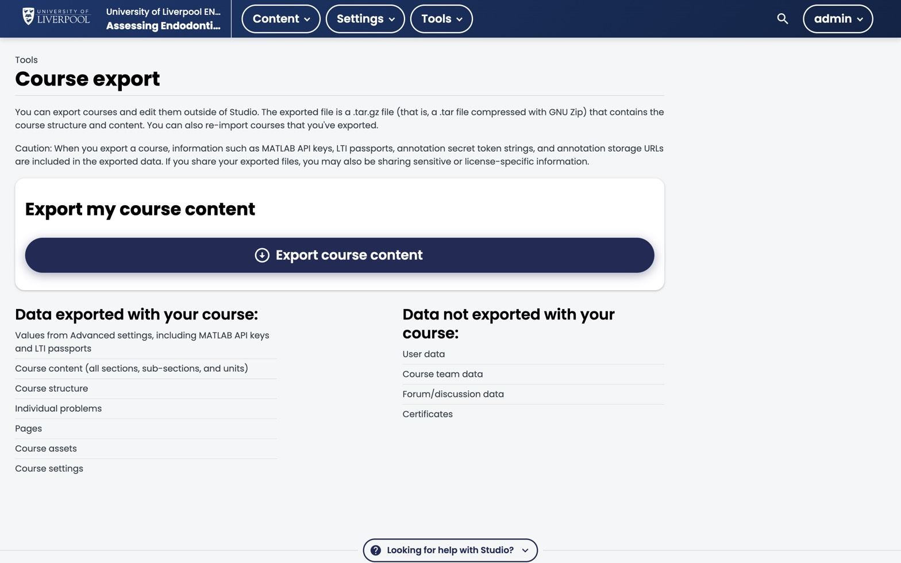

**OLX (Open Learning XML)** is what Studio saves to disk when you author a course. Every section, subsection, unit, and component lives in an XML file. You almost never need to edit OLX directly — Studio is the friendlier interface — but knowing it exists explains a lot.

*Studio → Tools → Course export. Click **Export course content** to download a `.tar.gz` of the course's OLX. User-specific data (grades, forum posts, certificates) stays in the LMS.*

## When you'll touch OLX

- **Course export / import** — Studio exports a tarball of OLX files. Useful for backups, version control, or moving content between environments.
- **Bulk content edits** — if you need to update 50 problems with the same correction, editing OLX in a text editor + re-import is faster than 50 Studio clicks.
- **XML-only problem features** — a handful of question features (partial credit, custom response, advanced numerical constraints) are only accessible via the XML view in the problem editor.

## What you won't do with OLX

- Build a course from scratch in a text editor. Use Studio.
- Edit OLX files directly on the server. Always export → edit → import.

## Where OLX lives in Studio

- *Tools → Export* writes the entire course OLX as a `.tar.gz`.
- *Tools → Import* reads it back in (overwriting Studio state — back up first).
- Inside the problem editor, **Edit → Settings → Advanced (XML)** shows the raw XML for that component.

## Should you version-control OLX?

For a CPD module: probably not — Studio is your source of truth.

For a multi-author postgraduate programme with frequent edits: yes, exported OLX in git gives you change tracking and rollback. Email [support@learning.endo360.co.uk](mailto:support@learning.endo360.co.uk) if you want this set up.
