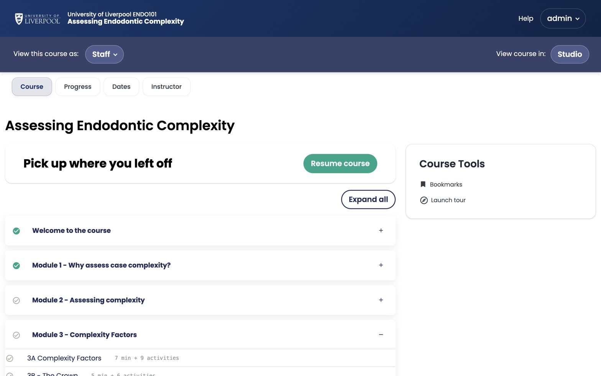

**Studio** is the authoring tool, at `studio.learning.endo360.uk`. It's where you create course shells, lay out the outline, add components, and publish to the LMS.

*The course home as a learner sees it. As an author you'll build this same outline inside Studio.*

## Studio at a glance

- **Outline** — section / subsection / unit hierarchy.
- **Content** — files & uploads, pages, video transcripts.
- **Settings** — schedule, grading, certificates, advanced settings.
- **Instructor** — bulk emails, cohorts, data download (visible in the LMS after publish).

## Studio vs LMS

| You do this in | Studio | LMS |
|---|---|---|
| Build the course | ✓ | |
| Preview as a learner | | ✓ |
| Manage enrolments / bulk email | | ✓ |

---

*Adapted from [Open edX — What Is Studio?](https://docs.openedx.org/en/latest/educators/concepts/openedx_platform/what_is_studio.html).*
