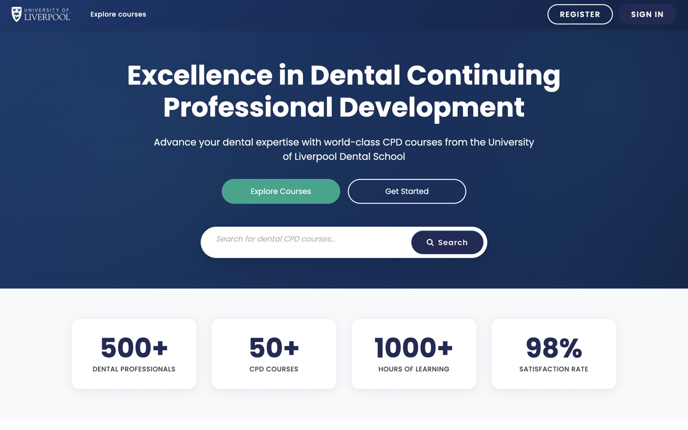
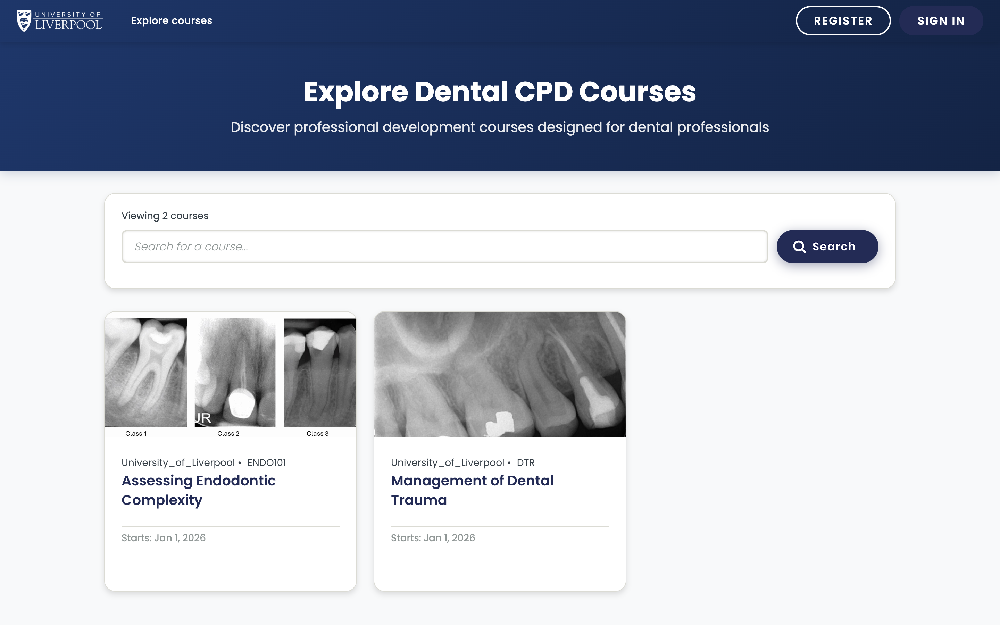
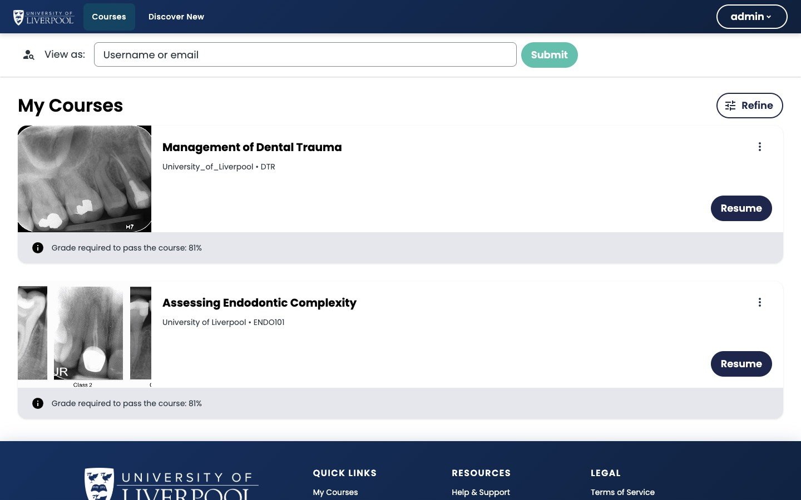

The **LMS** (Learning Management System) is what your CPD learners see at `learning.endo360.uk`. It's where they browse the course catalogue, enrol, watch videos, answer questions, and download certificates.

*The public LMS home at `learning.endo360.uk` — the first thing a learner sees before signing in.*

As a course author you'll spend most of your time in [Studio](../what-is-studio/) — but it's worth knowing the LMS view, because previewing your course as a learner is the best way to catch issues before publishing.

*The catalogue at `/courses`. Each course is published from Studio.*

*The dashboard after sign-in: enrolled courses, last-progress marker, and a **Resume** button straight into the last unit visited.*

## What learners can do here

- Browse and enrol in courses.
- Work through course content (text, video, problems, assessments).
- Track progress, view grades, and download certificates.
- Participate in discussions if enabled.

---

*Adapted from [Open edX — What Is the LMS?](https://docs.openedx.org/en/latest/educators/concepts/openedx_platform/what_is_lms.html).*
